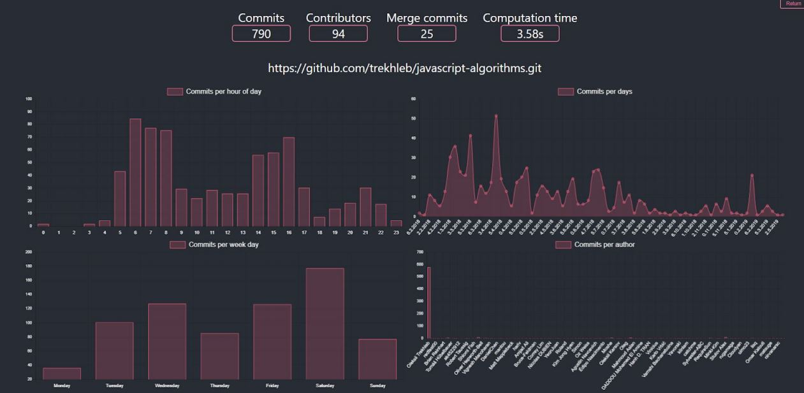

# GitHubRepositoryExplorer

#### A web application that allows you to analyze and visualize the repository's development history over time.  

## 1. About 

The user can provide a link to the repository located on GitHub together with the date range he is interested in. The results contain basic information about commits in the repository and detailed changes over time within the history of the repository. Application is designed using components written in Python, C # and JavaScript with React.js. 

## 2. Requirements:

### PythonApp:
- Python 3.7
- Flask
- gitpython
- Pydriller

### Web application:
- .NET CORE 2.2

### Client web application:
- node.js
- npm

The application works on both Windows and Linux environment.

## 3. Run instruction

Further steps assume that the packages required to run have been installed.

1. Download the repository
2. Go to location: IntegrationProject \ GitStatisticsLibrary
3. Open CLI and execution: flask run --port 5002
4. Go to location: IntegrationProject \ GitStatisticsWebApi \ git-statistics-web-app
5. Open CLI and execution: dotnet run
6. Go to location: IntegrationProject \ GitStatisticsWebApi \ git-statistics-client-app
7. Open CLI and execution: npm install and then npm start

This will open the browser tabs with the application running.
